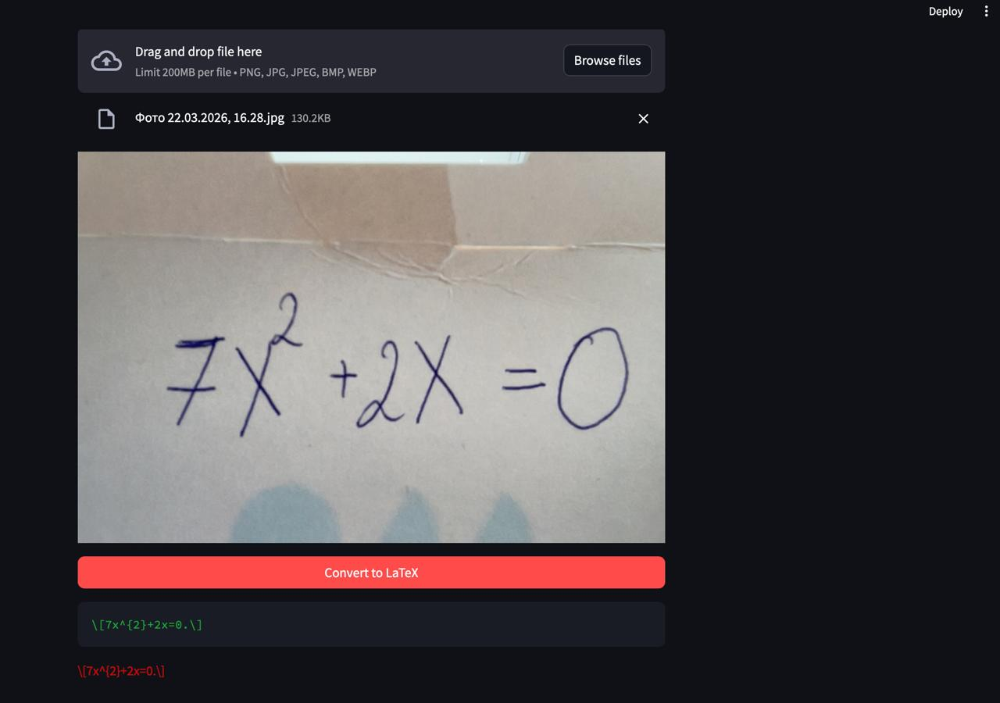

# Tech report: Handwritten Formula to LaTeX

## Model
- **Name**: SmolVLM-256M-Instruct
- **HF Name**: `HuggingFaceTB/SmolVLM-256M-Instruct`
- **Comparing zero-shot, one-shot generation with fine-tuning using 1 and 2 datasets**

## Evaluation scores

**CER (Character Error Rate) = edit_distance(prediction reference) / len(reference)**

- The closer to zero the better
- I decided to take this score as:
    - LaTeX is sensible to each symbol, so this metric is really important here
    - Easy to interpret

## Hyperparameters and datasets info

### Tuning hyperparameters

| Param | Value |
|----------|----------|
Learning rate| 0.0002 |
Effective batch size | 8 |
Num epochs | 1 |
Max sequence length | 2048 |
LoRA rank | 16 |
LoRA alpha | 32 |
LR scheduler | Cosine |
Warmup steps | 0.05 |
Gradient checkpointing | True |

### Datasets

| Dataset | Split | Usage |
|---------|-------|---------------|
`linxy/LaTeX_OCR` | train | Tuning and testing |
`deepcopy/MathWriting-human` | train (400 examples) | Tuning |

## Evaluation results

| Approach | CER |
|-------|-------|
1. Zero-shot | 1.3129 |
2. One-shot | 1.3385 |
3. SFT (LaTeX_OCR) | 0.5741 |
4. SFT (LaTeX_OCR + MathWriting) | 0.6454 |

## Links

- Model: https://huggingface.co/HuggingFaceTB/SmolVLM-256M-Instruct
- Dataset LaTeX_OCR: https://huggingface.co/datasets/linxy/LaTeX_OCR
- Dataset MathWriting: https://huggingface.co/datasets/deepcopy/MathWriting-human
